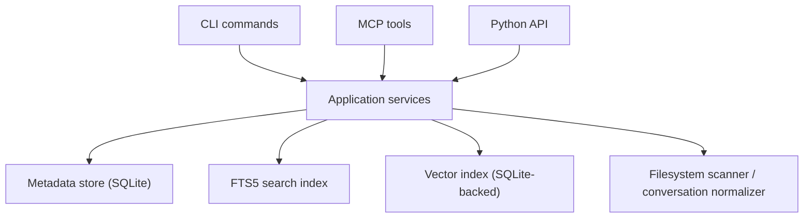

# MemPalace Architecture

## Purpose

`mempalace` is a local-first memory layer for AI assistants and coding agents.

Its job is not to replace an LLM. Its job is to:

- preserve raw source material
- index that material for retrieval
- attach provenance to every result
- expose a predictable tool and CLI surface for agents

The current branch standardizes around a project-local runtime:

- each repository has its own `.mempalace/`
- each repository has its own storage
- each repository can run its own MCP server

## Product Model

At a high level, the system behaves like this:

1. `mempalace init` creates a project-local runtime.
2. `mempalace ingest` or `mempalace ingest-chat-history` stores documents and segments.
3. `mempalace search` and related commands retrieve evidence with provenance.
4. MCP tools expose the same capabilities to agents.

The implementation favors explicit data models, deterministic processing where practical, and inspectable retrieval over opaque heuristics.

## Design Principles

- Local-first by default
- Preserve raw source text whenever possible
- Keep storage interfaces swappable
- Make retrieval inspectable
- Make write paths observable
- Prefer deterministic pipelines over hidden LLM behavior
- Keep CLI and MCP naming aligned
- Treat migration from legacy behavior as explicit work, not magic

## Current Runtime Topology



## Runtime Layout On Disk

Inside a project repository, the standard layout is:

```text
<repo>/
  .mempalace/
    config.yaml
    .gitignore
    runtime/
      metadata.sqlite3
```

Important notes:

- `.mempalace/config.yaml` is the project-local runtime config.
- `.mempalace/runtime/metadata.sqlite3` currently stores metadata, FTS state, facts, and the local vector index.
- `.mempalace/.gitignore` keeps runtime data out of source control.

## Layered Architecture

The codebase keeps legacy modules for compatibility, but the main service runtime is organized into layered responsibilities.

### Interfaces

Public entrypoints:

- [`mempalace/cli.py`](/Users/kynguyenpham/Memory/mempalace/cli.py)
- [`mempalace/mcp_server.py`](/Users/kynguyenpham/Memory/mempalace/mcp_server.py)
- [`mempalace/interfaces/api.py`](/Users/kynguyenpham/Memory/mempalace/interfaces/api.py)

Responsibilities:

- parse CLI or MCP inputs
- normalize arguments
- call application services
- serialize results back to JSON or human-readable output

Current public surface:

- CLI is unified around `init`, `ingest`, `search`, `status`
- MCP uses aligned names such as `mempalace_ingest`, `mempalace_search`, `mempalace_status`

### Application

Use-case orchestration lives in:

- [`mempalace/application/ingestion.py`](/Users/kynguyenpham/Memory/mempalace/application/ingestion.py)
- [`mempalace/application/conversation_ingestion.py`](/Users/kynguyenpham/Memory/mempalace/application/conversation_ingestion.py)
- [`mempalace/application/retrieval.py`](/Users/kynguyenpham/Memory/mempalace/application/retrieval.py)
- [`mempalace/application/fact_extraction.py`](/Users/kynguyenpham/Memory/mempalace/application/fact_extraction.py)
- [`mempalace/application/context.py`](/Users/kynguyenpham/Memory/mempalace/application/context.py)
- [`mempalace/application/reindexing.py`](/Users/kynguyenpham/Memory/mempalace/application/reindexing.py)
- [`mempalace/application/legacy_migration.py`](/Users/kynguyenpham/Memory/mempalace/application/legacy_migration.py)
- [`mempalace/application/project_profiles.py`](/Users/kynguyenpham/Memory/mempalace/application/project_profiles.py)
- [`mempalace/application/project_classification.py`](/Users/kynguyenpham/Memory/mempalace/application/project_classification.py)
- [`mempalace/application/filesystem_scan.py`](/Users/kynguyenpham/Memory/mempalace/application/filesystem_scan.py)
- [`mempalace/application/segmentation.py`](/Users/kynguyenpham/Memory/mempalace/application/segmentation.py)

Responsibilities:

- directory and file ingest
- conversation import
- project classification
- segmentation
- retrieval planning
- evidence lookup
- deterministic fact extraction
- context compaction
- legacy migration

### Domain

Canonical models live in:

- [`mempalace/domain/models.py`](/Users/kynguyenpham/Memory/mempalace/domain/models.py)

The runtime avoids metaphorical names and uses conventional records:

- `WorkspaceRecord`
- `SourceRecord`
- `DocumentRecord`
- `SegmentRecord`
- `FactRecord`
- `EntityRecord`
- `RelationRecord`
- `EpisodeRecord`
- `IngestionRun`
- `SearchRequest`
- `SearchResponse`
- `EvidenceTrail`

### Infrastructure

Concrete adapters live in:

- [`mempalace/infrastructure/settings.py`](/Users/kynguyenpham/Memory/mempalace/infrastructure/settings.py)
- [`mempalace/infrastructure/logging.py`](/Users/kynguyenpham/Memory/mempalace/infrastructure/logging.py)
- [`mempalace/infrastructure/storage/sqlite_catalog.py`](/Users/kynguyenpham/Memory/mempalace/infrastructure/storage/sqlite_catalog.py)
- [`mempalace/infrastructure/vector/hashing.py`](/Users/kynguyenpham/Memory/mempalace/infrastructure/vector/hashing.py)
- [`mempalace/infrastructure/vector/sqlite_index.py`](/Users/kynguyenpham/Memory/mempalace/infrastructure/vector/sqlite_index.py)

Responsibilities:

- load typed settings
- create storage directories
- persist metadata, FTS, facts, and entities in SQLite
- generate deterministic embeddings
- provide vector search over the local store
- configure structured logging

## Core Data Model

### Workspace

The top-level tenant boundary.

Current state:

- single-user and project-local
- one workspace per project config

Future direction:

- multi-workspace and multi-user hosting can be added without renaming core objects

### Source

Represents the origin of raw data:

- filesystem file
- chat export file
- future external importer output

Important fields:

- `source_type`
- `uri`
- `checksum`
- `first_seen_at`
- `last_seen_at`

### Document

Represents one persisted raw document.

Examples:

- a source file
- a normalized conversation transcript
- one migrated legacy drawer

Important properties:

- stable `document_id`
- verbatim `raw_text`
- `checksum`
- `observed_at`
- metadata such as `wing`, `room`, `relative_path`, `session_id`

### Segment

Represents the retrieval unit.

Important properties:

- `segment_index`
- `text`
- `start_offset`
- `end_offset`
- `token_count`
- metadata copied or derived from the document

### Fact, Entity, Relation

The current fact layer is deterministic and conservative.

What exists now:

- `FactRecord`
- `EntityRecord`
- `RelationRecord` model types
- fact and entity persistence in the SQLite catalog

What is not yet fully implemented:

- a complete relation graph replacing the legacy knowledge graph
- higher-order reasoning or LLM-driven extraction pipelines

### Episode

Represents time-aware memory for session or event recall.

Current behavior:

- derived from documents and conversation metadata
- useful for session startup and continuity

## Ingestion Architecture

There are two primary ingest paths.

### Project Ingestion

Entry:

- `mempalace ingest`
- MCP: `mempalace_ingest`

Processing flow:

1. Discover project-local config.
2. Scan the directory recursively.
3. Respect `.gitignore` by default.
4. Allow explicit include overrides with `include_ignored`.
5. Filter by configured extensions and selected no-extension filenames.
6. Load file contents.
7. Compute checksums.
8. Determine whether each source is new, changed, or unchanged.
9. Classify `wing` and `room` using project manifest rules when present.
10. Persist document and segment records.
11. Update FTS and vector index.

Current project classification order:

1. path pattern match
2. filename match
3. keyword scoring
4. fallback to `default_room_name`

Manifest files supported today:

- `mempalace.yaml`
- `mempalace.yml`
- `mempal.yaml`
- `mempal.yml`

### Conversation Ingestion

Entry:

- `mempalace ingest-chat-history`
- MCP: `mempalace_ingest` with `mode="convos"`

Processing flow:

1. Scan files with configured conversation extensions.
2. Normalize supported export shapes into a common transcript form.
3. Extract segments with `exchange` or `general` mode.
4. Persist documents and segments.
5. Store session metadata when available.
6. Index the normalized text for retrieval.

### Idempotence

Current ingest idempotence is content-based, not path-only.

What the runtime records:

- source checksum
- document checksum
- per-run results

Operational effect:

- unchanged files are skipped
- changed files are updated
- per-file results show `written`, `updated`, or `skipped`

## Retrieval Architecture

### Supported Modes

Current supported search modes:

- `keyword`
- `semantic`
- `hybrid`

Additional supported retrieval forms:

- explicit time-range search
- document fetch
- evidence trail lookup
- episode recall
- startup-context preparation

### Current Retrieval Pipeline

1. Build a `SearchRequest`.
2. Run keyword retrieval via FTS.
3. Run semantic retrieval via deterministic embeddings plus vector index.
4. Merge candidate sets.
5. Apply scoring weights from config.
6. Apply time filters and exact metadata filters.
7. Build provenance-rich results and a retrieval plan.

### Provenance Guarantees

Search results now include:

- `source_uri`
- `document_id`
- `segment_id`
- `observed_at` or best-known time
- score breakdowns
- retrieval reason
- verbatim excerpt

This is one of the main architectural goals of the refactor: retrieval should be inspectable, not just “similar.”

## Fact Extraction And Evidence

Current fact behavior:

- deterministic pattern-based extraction
- fact records store confidence and evidence links
- evidence trails can reconstruct the surrounding document context

This makes the system useful for agent workflows without overclaiming semantic precision.

## CLI And MCP Surfaces

### Primary CLI

Current primary commands:

- `mempalace init`
- `mempalace ingest`
- `mempalace ingest-chat-history`
- `mempalace search`
- `mempalace status`

Additional operator commands:

- `mempalace fetch-document`
- `mempalace fetch-evidence`
- `mempalace extract-facts`
- `mempalace query-facts`
- `mempalace reindex`
- `mempalace recall-episodes`
- `mempalace compact-session-context`
- `mempalace prepare-startup-context`
- `mempalace migrate-legacy`

### MCP Tools

The MCP server exposes the same runtime semantics with names aligned to the CLI:

- `mempalace_status`
- `mempalace_ingest`
- `mempalace_ingest_source`
- `mempalace_search`
- `mempalace_search_time_range`
- `mempalace_explain_retrieval`
- `mempalace_fetch_document`
- `mempalace_fetch_evidence`
- `mempalace_extract_facts`
- `mempalace_query_facts`
- `mempalace_reindex`
- `mempalace_recall_episodes`
- `mempalace_compact_session_context`
- `mempalace_prepare_startup_context`
- `mempalace_migrate_legacy`

Legacy MCP tools are intentionally hidden.

## Observability

The current runtime emits structured logs for important paths.

Examples of events emitted by services:

- ingest started/completed
- retrieval started/completed
- fact extraction events
- reindex events

Important identifiers:

- `workspace_id`
- `run_id`
- `document_id`
- `segment_id`
- event-specific counts

Logging configuration is controlled through:

- [`config.example.yaml`](/Users/kynguyenpham/Memory/config.example.yaml)
- [`mempalace/infrastructure/settings.py`](/Users/kynguyenpham/Memory/mempalace/infrastructure/settings.py)

## Operational Model

### Recommended Per-Repo Setup

1. Create a repo-local virtual environment.
2. Install `mempalace` into that environment.
3. Run `mempalace init` inside the repository.
4. Run `mempalace ingest`.
5. Optionally ingest chat history.
6. Start the MCP server from the repo root.

### Backup And Restore

Current project data can be backed up by copying:

- `.mempalace/config.yaml`
- `.mempalace/runtime/metadata.sqlite3`

This is enough to restore the local runtime state for the current backend.

### Reindexing

If index state needs rebuilding without re-reading source files:

- use `mempalace reindex`

This keeps reindex behavior separate from ingest behavior.

## Security And Privacy

Current posture:

- local-first storage
- no required external API for the default runtime
- MCP server runs against repo-local storage

Operational caution:

- chat exports and codebases can contain secrets
- `.mempalace/` should stay uncommitted unless deliberately redacted
- agent tool clients should launch MCP with the intended repo root as `cwd`

## Known Limitations

Current branch limitations:

- the vector backend is deterministic and local, not production-grade semantic ranking
- the structured memory layer is still simpler than a full graph model
- legacy modules still exist for compatibility and migration
- hosted deployment, Postgres, and alternative vector backends are not yet first-class runtime options

## Target Direction

The current architecture is intentionally pragmatic.

What is already true:

- the public CLI is unified around the service runtime
- MCP and CLI use aligned names
- retrieval is provenance-aware
- storage is no longer hard-coded to Chroma in the main runtime

What still remains to reach the longer-term target:

- richer schema versioning and operator migration tooling
- configurable embedding and vector backends
- more capable structured relation modeling
- optional hosted and multi-user deployment support
- stronger benchmark and operator documentation around larger datasets
